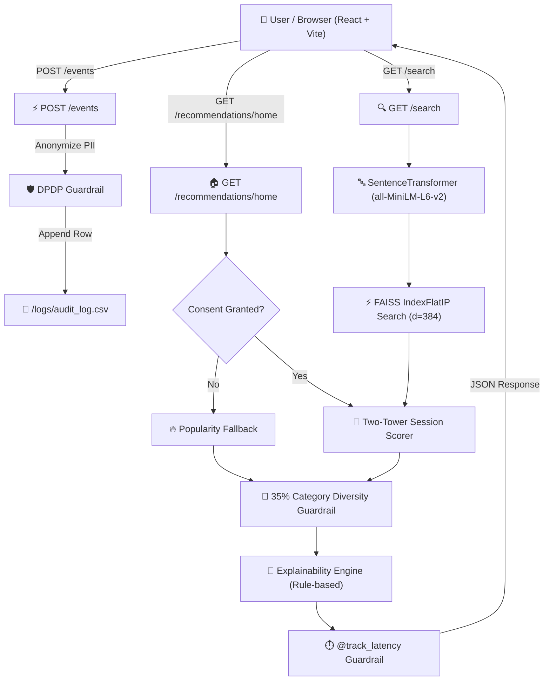

# Discovery Engine 🚀
> **Track 7 · Personalized Multi-Intent Product Recommendations & Discovery Engine**

Real-time multi-intent product discovery engine featuring personalized home feeds, complete-the-look bundle recommendations, semantic search re-ranking, 35% category diversity caps, and DPDP-compliant privacy guardrails.

### 🌐 Live Demo & Endpoints
- **Live Web Application (Vite Dev)**: `http://localhost:5173`
- **Production Container Web App**: `http://localhost:80`
- **FastAPI Backend Server**: `http://localhost:8000`
- **Interactive API Documentation (Swagger UI)**: `http://localhost:8000/docs`

---

## 📌 Problem Statement Summary

Modern e-commerce recommendation systems frequently face three major challenges:
1. **Lack of Real-Time Session Adaptation**: Recommendations fail to update dynamically as users browse within a single session.
2. **Category Echo Chambers**: Oversaturated feeds bombard shoppers with repetitive product categories.
3. **Opaque Black-Box Outputs**: Users cannot understand *why* specific items are recommended to them, diminishing trust.

**Discovery Engine** addresses these challenges through a modular, high-performance architecture:
- **Sub-80ms Real-Time Inference**: Vector retrieval via FAISS (`IndexFlatIP`).
- **Two-Tower Session Scorer**: Blends base cosine similarity, exponential recency decay over the last 5 session events, and log-scaled popularity priors.
- **35% Category Diversity Guardrail**: Re-orders feeds so no single product category exceeds 35% of the returned set, demoting overrepresented items down the list instead of discarding them.
- **Explainability & DPDP Privacy**: Attaches plain-English reason captions to every card without LLM latency, while pseudonymizing customer IDs into SHA-256 hashes and enforcing consent checks.

---

## 🏗️ System Architecture



---

## 🔄 AI & Recommendation Workflow

The recommendation lifecycle follows a 5-stage pipeline:

```
[1. Embeddings] ➔ [2. Vector Retrieval] ➔ [3. Two-Tower Scoring] ➔ [4. Diversity Cap] ➔ [5. Explainability]
```

1. **Multimodal Embeddings**: Text representations (Title + Category + Attributes + Description) are encoded using `sentence-transformers` (`all-MiniLM-L6-v2`) into normalized 384-dimensional vectors.
2. **FAISS Vector Retrieval**: Candidate items are retrieved in $<5\text{ms}$ using inner-product similarity (`IndexFlatIP`).
3. **Two-Tower Session Scoring**:
   $$\text{Final Score} = 0.50 \cdot \text{Sim}_{\text{recent}} + 0.40 \cdot \sum_{i=1}^{5} w_i \text{Sim}_i + 0.10 \cdot \frac{\ln(1 + \text{Pop})}{\ln(1 + \text{MaxPop})}$$
   where $w_i = e^{-0.4 (5 - i)}$ applies exponential decay to session events.
4. **Category Diversity Guardrail**: Ensures no category exceeds 35% in the top-K window by demoting overrepresented candidates down the list without dropping them.
5. **Explainability Engine**: Attaches deterministic, plain-English reason captions (e.g. *"Matches style of recent item you viewed"*, *"Popular choice in Tops"*).

---

## 🛠️ Technology Stack

- **Backend**: Python 3.11, FastAPI, Uvicorn, PyTorch, FAISS (`faiss-cpu`), SentenceTransformers, Pandas, PyArrow, PyTest, HTTPX
- **Frontend**: React 19, Vite, Tailwind CSS v4, Axios, Plus Jakarta Sans Typography
- **Infrastructure & Containerization**: Docker (multi-stage builds), Docker Compose, Nginx, Redis

---

## 🚀 Setup & Execution Instructions

### Option 1: Docker Compose (Recommended)

Make sure Docker Desktop is running, then execute:

```bash
# Build and start backend, frontend, and redis containers
docker compose up --build -d

# Verify container status
docker compose ps
```

- **Frontend App**: `http://localhost:5173` (or `http://localhost:80`)
- **Backend API**: `http://localhost:8000`
- **Interactive API Docs (Swagger)**: `http://localhost:8000/docs`

---

### Option 2: Local Manual Setup

#### 1. Backend Setup
```bash
cd discovery-engine/backend

# Create & activate Python virtual environment
python -m venv venv
# On Windows:
.\venv\Scripts\activate
# On macOS/Linux:
source venv/bin/activate

# Install requirements
pip install -r requirements.txt

# Run dataset sampling & cleaning scripts (if raw data not present, synthetic data generates automatically)
python ../data/subsample.py
python ../data/clean.py

# Build embeddings & FAISS index
python embeddings/build_text_embeddings.py
python retrieval/build_index.py

# Start FastAPI server
uvicorn main:app --host 127.0.0.1 --port 8000 --reload
```

#### 2. Frontend Setup
```bash
cd discovery-engine/frontend

# Install dependencies
npm install

# Start Vite development server
npm run dev
```

#### 3. Running Automated Tests
```bash
cd discovery-engine/backend

# Run API test suite
pytest tests/test_api.py -v

# Run Guardrail unit tests
python recommend/diversity.py
python guardrails/dpdp.py
python guardrails/explain.py
python guardrails/latency.py
```

---

## 🌐 Live Demo & API Endpoints Summary

| Method | Endpoint | Description |
| :--- | :--- | :--- |
| `GET` | `/health` | Service health status and loaded dataset/index metrics |
| `POST` | `/events` | Logs session clicks/views with DPDP anonymization |
| `GET` | `/recommendations/home` | Personalized home feed (Scoring + Diversity + Explainability) |
| `GET` | `/recommendations/complete-the-look/{article_id}` | Co-purchased & vector complementary item bundles |
| `GET` | `/search?q=...` | Semantic query search re-ranked with session context |
| `GET` | `/articles/{article_id}` | Single article detail lookup |
| `GET` | `/articles` | Filtered & paginated article catalog listing |

---

## 🔒 Privacy & DPDP Compliance
- **Zero Raw PII Storage**: All customer IDs are pseudonymized into deterministic SHA-256 hashes (`pseudo_<hash[:16]>`).
- **Consent Guardrail**: Revoking consent (`consent=false`) immediately disables personalization and falls back to global popularity recommendations.
- **Audit Logging**: All system actions are logged to `/backend/logs/audit_log.csv` with strict PII field sanitization.
